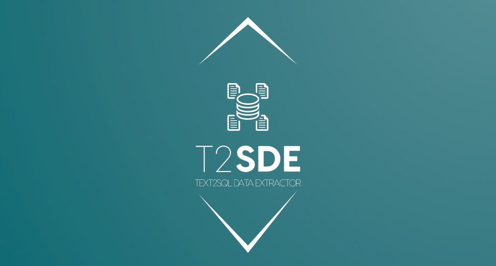
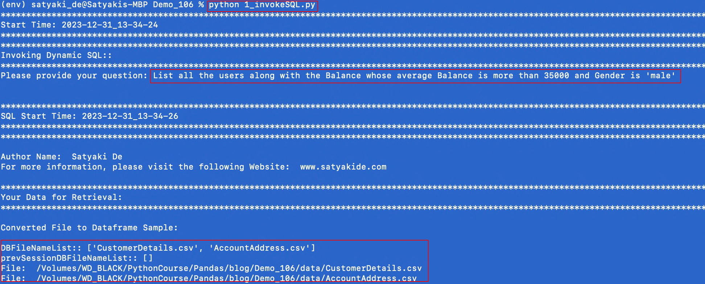
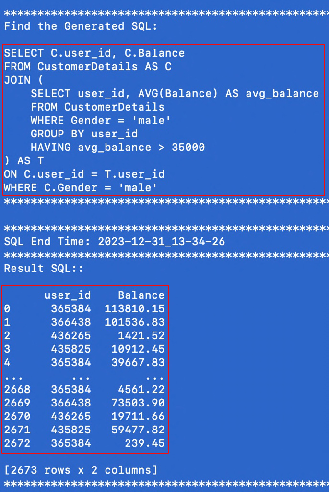

# Text2SQL Data Extractor (T2SDE) - Query on Data source by converting simple text into a SQL using Open AI, Python & Flask



## About this package

This new solution will contextualize the source files & then read the data into the pandas data-frame, and then dynamically create the SQL & execute it. Then, fetch the data from the sources based on the query generated dynamically. This project is for the advanced Python developer and data Science Newbie.


## How to use this package

(The following instructions apply to Posix/bash. Windows users should check
[here](https://docs.python.org/3/library/venv.html).)

First, clone this repository and open a terminal inside the root folder.

Create and activate a new virtual environment (recommended) by running
the following:

```bash
python3 -m venv venv
source venv/bin/activate
```

Install the requirements:

```bash
pip install -r requirements.txt
```

Run the server, which will interact with Open AI server by controlling the context limits.

```bash
python 1_invokeSQLServer.py
```

Let's run the main application, which will provide the Open AI response from the source data by querying based on simple text & get the SQL response based on that -

```bash
python 1_invokeSQL.py
```

Please find the some of the important dependent package -

```

pip install openai==1.6.1
pip install pandas==2.1.4
pip install Flask==3.0.0
pip install SQLAlchemy==2.0.23


```

Install the above requirements.

Let us understand the Question that we asked for this demo purpose -



And, here is the SQL that the application generates dynamically based on the metadata of the source files -



Note that the debug indicator is set to "Y". This will generate logs. If you change this to 'N'. No logs will be generated. However, the process will be faster.

## Screenshots


## Resources

- To view the complete demo with sound, check out our [YouTube Page](https://youtu.be/98mGezslnpI).
- To view on Python, check out the [Python Page](https://docs.python.org/3/).
- To view more on the OpenAI, check out this [OpenAI Official Page](https://platform.openai.com/examples).
- To view more on the SQLAlchemy, check out this [SQLAlchemy Official Page](https://docs.sqlalchemy.org/en/20/).
- To view more on the Flask, check out this [Flask Official Page](https://flask.palletsprojects.com/en/3.0.x/).
